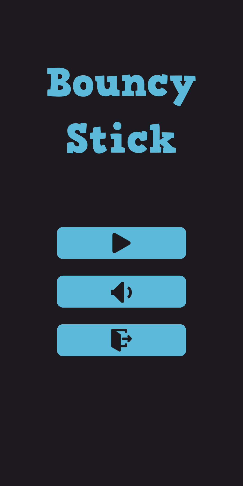
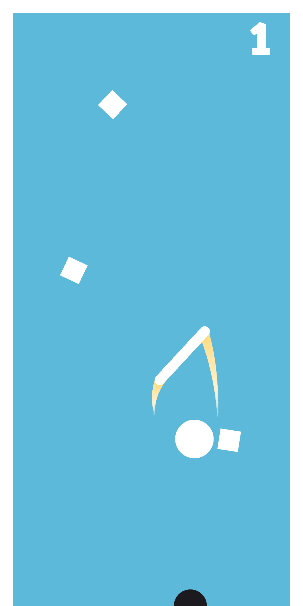

# Bouncy Stick
Bouncy Stick is a simple hyper-casual game where you control a bouncing stick, navigating through obstacles and collecting points along the way! Tap and swipe to guide the stick, time your jumps, and get the highest score possible!

Think you’ve got the reflexes for it? Jump in and see how far you can go! 🏆🎮

## Screenshots

  
  
  

## Download
- [:sparkles: Download from Itch.io](https://hieubigby.itch.io/bouncy-stick)

## Credits
- [Original Project](https://github.com/zerefgd/TrickyStick)
- Game Engine: [Unity](https://unity3d.com/)
- Thanks to all of the game development community for their awesome help.
